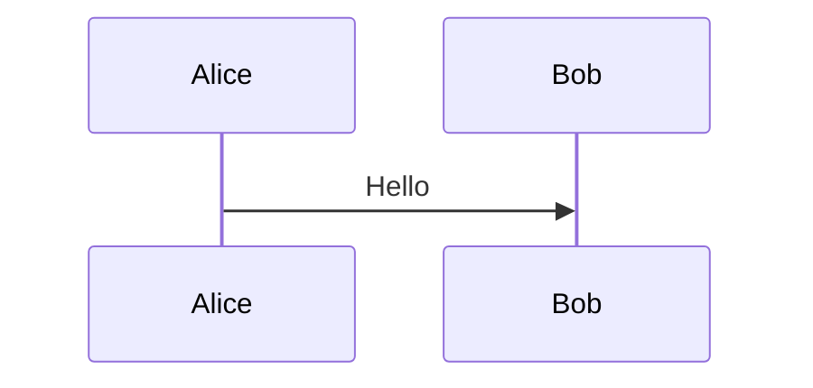

# tool-arch-diagram-generator

Generate **offline** HTML architecture diagrams from Mermaid inside Markdown.

## Visual Guide

Open `guide.html` locally for a visual overview of:

- what was stabilized in this skill
- when it should trigger
- the input/output boundary
- the minimum validation command
- a rendered Mermaid example

## What It Does

- Reads a Markdown file that contains Mermaid diagrams
- Creates an offline `index.html` with rendered diagrams
- Supports fenced blocks (recommended) and a fallback for unfenced `sequenceDiagram`-style blocks

## Input Format

**Recommended (fenced):**

```md

```

**Fallback (unfenced):**

```md
sequenceDiagram
    Alice->>Bob: Hello
```

## Offline Requirement

This tool does **not** use CDN. You must provide a local `mermaid.min.js` file.
Set it via `.env` or `--mermaid-js`. If you place `mermaid.min.js` in this tool directory, it will be picked up automatically.

## Config

- `MERMAID_JS_PATH`: path to `mermaid.min.js`

See `.env.example`.

## Usage

1. Preview detection:

```bash
python main.py --input /path/to/arch.md --dry-run
```

2. Generate offline HTML:

```bash
python main.py \
  --input /path/to/arch.md \
  --output ./dist \
  --title "Project Ingestion Bot" \
  --mermaid-js /path/to/mermaid.min.js
```

The output will be `./dist/index.html`.

## Example (from repo)

```bash
python main.py \
  --input ../skill-content-to-html/input/架构sample.md \
  --output ./dist \
  --title "Project-Ingestion-Bot" \
  --mermaid-js /path/to/mermaid.min.js
```

## Parameters

- `--input`: Markdown file path (required)
- `--output`: directory or HTML file path (default `./dist`)
- `--title`: HTML title
- `--mermaid-js`: local path to `mermaid.min.js` (offline)
- `--dry-run`: only list detected diagrams

## Notes

- For reliable parsing, use fenced ` ```mermaid ` blocks.
- If no Mermaid is found, the script exits with a readable error.
